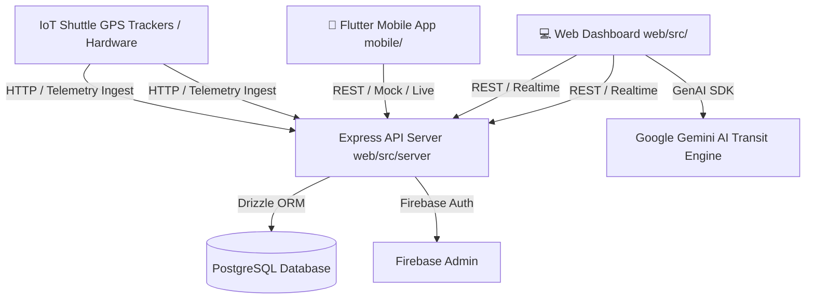

# 🚍 Ooyalo - Campus Shuttle Tracking & Telemetry Platform

<div align="center">
  <p><strong>Real-time campus transit intelligence, live GPS telemetry, intelligent arrival forecasting, and multi-platform fleet management.</strong></p>
  <p>Built for the University of Ghana campus mobility network.</p>
</div>

---

## 📖 Overview

**Ooyalo** is an end-to-end campus mobility platform designed to eliminate transit friction, optimize shuttle frequency, and provide real-time visibility for students, staff, operators, and drivers.

The ecosystem consists of two core clients and a unified backend:
1. **📱 Cross-Platform Mobile Client (`mobile/`)**: Flutter app for live GPS map tracking, upcoming stop discovery, occupancy monitoring, arrival notifications, and accessibility requests.
2. **💻 Web & Fleet Management Dashboard (`src/`)**: React 19 web app with interactive Leaflet transit maps, fleet telemetry monitoring, driver dispatch, route management, and Gemini AI transit assistant.
3. **⚙️ Backend API & Telemetry Engine (`src/server/`)**: Express + Drizzle ORM + PostgreSQL service ingesting high-frequency IoT GPS hardware pings, solar/battery health data, and dispatch feeds.

---

## 🏛️ System Architecture



---

## 📂 Repository Structure

```
Ooyalo/
├── mobile/                        # 📱 Flutter Mobile Application
├── web/                           # 💻 Web Dashboard, Express Backend API & DB
│   ├── src/                       # React 19 UI, Express server, Drizzle DB, services
│   │   ├── components/            # React UI components (LiveMap, DispatchOps, etc.)
│   │   ├── data/                  # Campus mock coordinates & routes
│   │   ├── db/                    # PostgreSQL Drizzle schema & migrations
│   │   ├── lib/                   # Firebase Auth & Admin client
│   │   ├── server/                # Express API server & telemetry ingestion
│   │   └── services/              # Simulation engine & sound effects
│   ├── index.html                 # Web HTML entry
│   ├── package.json               # Web & server dependencies
│   ├── tsconfig.json              # TypeScript configuration
│   ├── vite.config.ts             # Vite build & reverse proxy config
│   └── .env.example               # Environment variable template
│
├── mobile/                        # 📱 Flutter Cross-Platform Mobile Application
│   ├── lib/                       # App source (UI, ViewModels, Repositories, Services)
│   ├── test/                      # Automated unit & integration tests
│   ├── android/                   # Android native platform files
│   └── pubspec.yaml               # Flutter package configuration & dependencies
│
├── src/                           # 💻 Web Dashboard & Fleet Console
│   ├── components/                # React components (Map, RoutePlanner, ShuttleList, etc.)
│   ├── db/                        # Database schema & Drizzle ORM setup
│   ├── lib/                       # Firebase & shared utilities
│   ├── server/                    # Express API server & telemetry ingestion endpoints
│   ├── services/                  # Gemini AI and client-side data services
│   ├── App.tsx                    # Main Web Dashboard UI
│   └── main.tsx                   # React entry point
│
├── .env.example                   # Environment configuration template
├── package.json                   # Web & server dependencies (React, Vite, Express, Drizzle)
├── tsconfig.json                  # TypeScript configuration
└── vite.config.ts                 # Vite build configuration
├── package.json                   # 🚀 Root orchestration scripts (dev, build, lint)
├── .gitignore                     # Monorepo gitignore rules
└── README.md                      # Documentation
```

---

## 🚀 Quick Start Guide

### 1. Web Dashboard & Server Setup

**Prerequisites:** Node.js (v18+) or Bun
**Prerequisites:** Node.js (v18+)

1. Install dependencies:
1. Install web dependencies:
   ```bash
   npm install
   cd web && npm install && cd ..
   ```

2. Configure environment variables:
2. Start development server & API (Runs both Express API on `:3001` and Vite on `:3000`):
   ```bash
   cp .env.example .env
   ```
   Set `GEMINI_API_KEY`, database credentials, and `APP_URL` as needed.

3. Start development server & API:
   ```bash
   npm run dev
   ```
   The dashboard runs at `http://localhost:3000`.
   * Or run individually:
     * `npm run dev:server` (Express API on `http://localhost:3001`)
     * `npm run dev:web` (Vite UI on `http://localhost:3000`)

---

### 2. Flutter Mobile App Setup

**Prerequisites:** Flutter SDK (`>=3.5.0`) & Dart SDK

1. Navigate to the mobile directory:
   ```bash
   cd mobile
   ```

2. Fetch Flutter packages:
   ```bash
   flutter pub get
   ```

3. Run static analysis & test suite:
   ```bash
   flutter analyze
   flutter test --no-pub
   ```

4. Launch on emulator or connected device:
   ```bash
   flutter run
   ```

---

## 📡 API & IoT Telemetry Endpoints

- `GET /api/health` — Service health check.
- `POST /api/telemetry` — Ingestion endpoint for onboard IoT GPS trackers (vehicle ID, coordinates, speed, heading, battery voltage, solar watts, satellites).
- `POST /api/seed` — Development database seeder.

---

## 📄 License
Copyright © 2026 Ooyalo Transit Network. All rights reserved.
